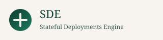
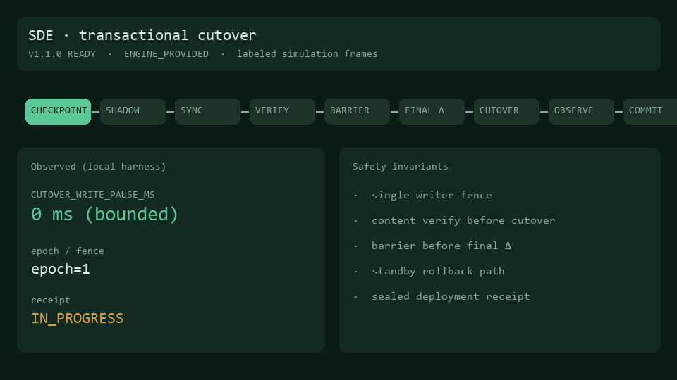
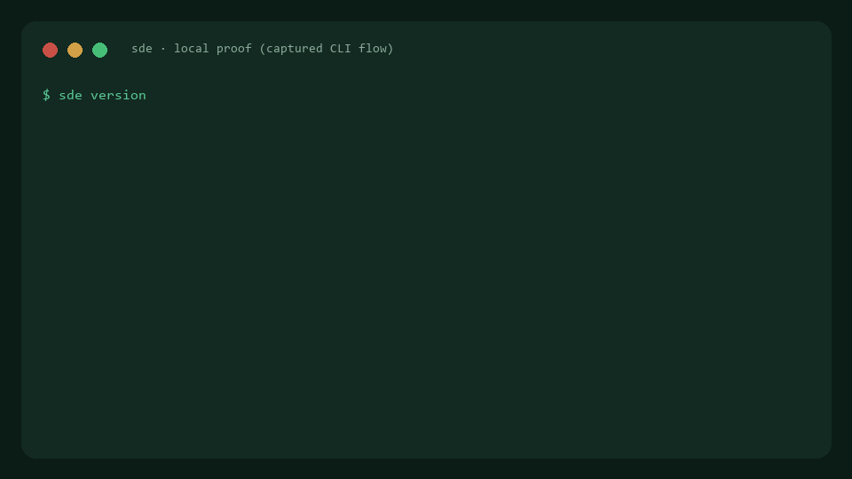
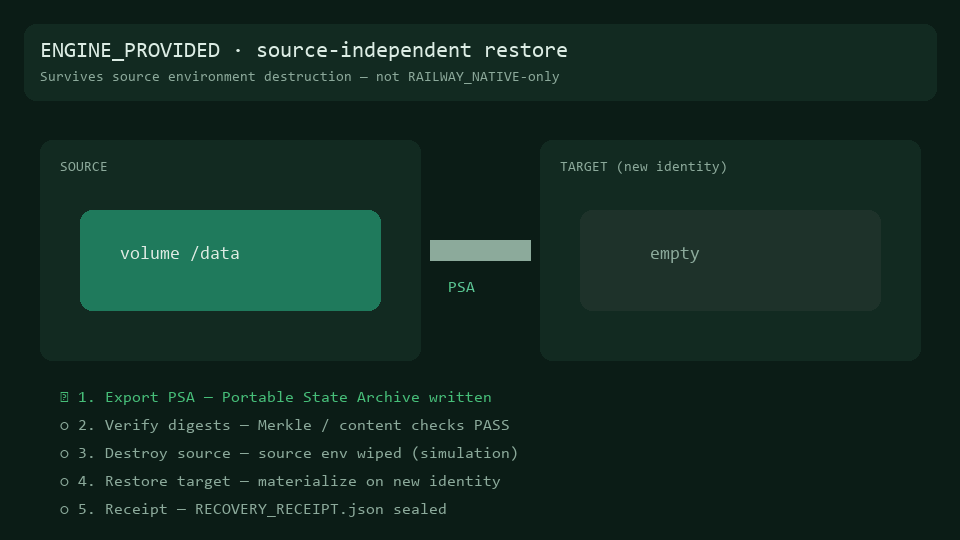

# Stateful Deployments Engine (SDE)


---

## License & acquisition

This project is **proprietary**. Production use, redistribution, and commercial deployment require a written commercial license or completed acquisition. See [LICENSE](./LICENSE) and [ACQUISITION.md](./ACQUISITION.md). Contact [@theworker02](https://github.com/theworker02).


<p align="center">
  
</p>

<p align="center">
  
  
  
  
  <a href=".github/workflows/test.yml"></a>
  <a href=".github/workflows/pages.yml"></a>
</p>

**Independent project — not affiliated with Railway.**

General-purpose **state lifecycle engine** for arbitrary volume-backed workloads:
transactional cutover, mutation journals, portable State Archives, fire drills, and
verified recovery — beyond database-specific backup tooling.

## Get started in 5 minutes

```powershell
.\scripts\install.ps1
.\dist\sde.exe doctor
.\dist\sde.exe demo --root .sde
.\evaluate.ps1
```

```bash
./scripts/install.sh
./dist/sde doctor
./dist/sde demo --root .sde
./evaluate.sh
```

Full path: [`docs/GETTING_STARTED.md`](docs/GETTING_STARTED.md).

## Proof (live demo GIFs)

Measured local cutover on evaluation host: **barrier ~16 ms**, **write pause ~15 ms**, 129 mutations synced.

<p align="center">
  
</p>

<p align="center">
  
</p>

<p align="center">
  
</p>

Transcripts: [`assets/demo/`](assets/demo/) · Pages proof: [`site/proof.html`](site/proof.html)

## Live demo (GitHub Pages)

Interactive browser simulation + proof GIFs:

- **https://theworker02.github.io/stateful-deployments-engine/**
- Site source: [`site/`](site/)

## What it does

| Capability | Notes |
|------------|--------|
| Transactional deploy | Checkpoint → sync → verify → barrier → cutover → observe → commit |
| Portable State Archive | ENGINE_PROVIDED; usable after source env destruction |
| Fire drills / DR plan | Isolated restore verification + readiness scorecard |
| Embed modes | CLI · LIBRARY · CONTROL-PLANE (`internal/embed`) |
| Railway | Live GraphQL when `SDE_RAILWAY_LIVE=1`; offline ENGINE_PROVIDED by default |
| Operator UX | `sde doctor` · `sde railway status --probe` · install scripts |

Railway already offers volumes, backups, Postgres PITR, logical dumps, and live resize.
SDE targets **generic FS/state mobility** and independent escrowed recovery. See
[`docs/RAILWAY_GAP_MATRIX.md`](docs/RAILWAY_GAP_MATRIX.md).

**License:** Proprietary Pre-Acquisition — [`LICENSE`](./LICENSE).  
**Acquisition:** [`ACQUISITION_READINESS_REPORT.md`](./ACQUISITION_READINESS_REPORT.md) — **READY**

## Architecture

```
App → journal → ACTIVE volume
             ↘ shadow sync → verify → barrier → cutover → observe → commit
             ↘ ENGINE_PROVIDED PSA → escrow / clone / fire-drill
```

Networking / tunnels / mesh: **out of scope** (separate project).

## Documentation

- [Getting started](docs/GETTING_STARTED.md) · [Quick start](docs/QUICKSTART.md) · [CLI](docs/CLI.md)
- [15-minute demo](docs/ACQUISITION_DEMO.md) · [Integration API](docs/INTEGRATION_API.md)
- [Railway live](docs/RAILWAY_LIVE.md) · [Failure atlas](docs/FAILURE_ATLAS.md)
- [Site](site/) · [Brand](docs/BRAND_GUIDELINES.md) · [Changelog](CHANGELOG.md)

**Status:** **v1.1.1 FROZEN** — acquisition verdict **READY**. Tag `v1.1.1` is the diligence freeze.
