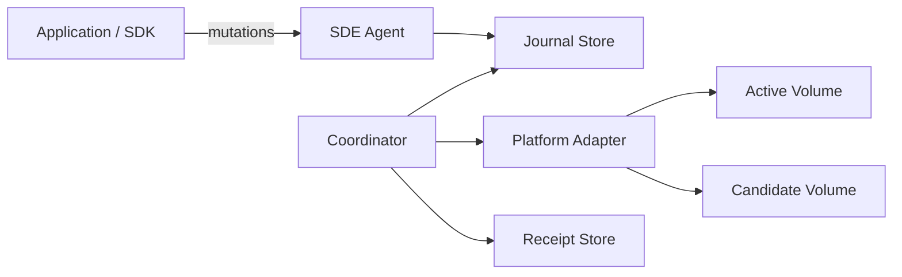

# Threat Model (deepening)

This document extends [SECURITY_MODEL.md](../SECURITY_MODEL.md) with STRIDE-oriented
assets and trust boundaries for diligence reviewers.

## Assets

1. Persistent application state (volume contents)
2. Mutation journal integrity / ordering
3. Epoch + fencing tokens
4. Deployment receipts (audit evidence)
5. Coordinator durable FSM snapshot

## Trust boundaries

Networking overlays, tunnels, and mTLS meshes are **out of scope** for this engine
(owned by platform / separate networking layer).

## STRIDE summary

| Category | Example threat | Mitigation |
|----------|----------------|------------|
| Spoofing | Stale coordinator after failover | Epoch + fence token checks |
| Tampering | Bit-flip on candidate | Checksum / Merkle verify before cutover |
| Repudiation | Silent failed deploy | Sealed receipts + event log |
| Info disclosure | Journal payloads | Local FS permissions; encrypt at rest via platform |
| DoS | Non-convergent sync forever | Convergence detector + abort |
| Elevation | Skip safety gate | No silent overrides; explicit override flag only |

## Non-goals

- Replacing database replication protocols
- Providing a general multi-tenant SaaS control plane in v0
- Implementing Agent 3 networking (tunnels / mesh / private DNS)

See also: [SECURITY.md](../SECURITY.md) for reporting.
